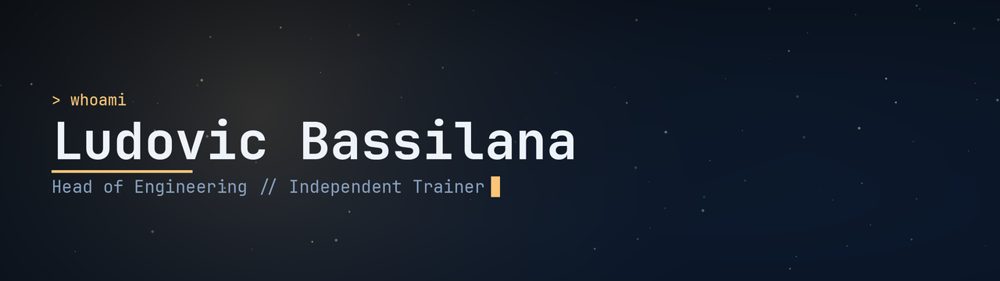

<div align="center">
<a href="README.md">🇬🇧 English</a> &nbsp;·&nbsp; <strong>🇫🇷 Français</strong>
</div>
<br>

<h3 align="center">Dev hard, play harder.</h3>

```
$ git log --oneline --author="Anakior"

diriger l'engineering d'un SaaS e-commerce français
former des devs, peu importe le langage
faire un jeu et en modéliser les assets sous Blender
écrire de la dark fantasy quand les mots viennent
démonter des systèmes de RPG pour le plaisir
... commencé gamin, toujours pas de rollback
```

<br>

Je dirige l'équipe derrière un SaaS e-commerce multi-tenant chez [WiziShop](https://wizishop.com) : une stack PHP et Angular qu'on modernise petit à petit vers CQRS et DDD. Je tiens davantage aux équipes et aux systèmes qui durent qu'à ce qui fait une belle démo. À côté, je forme des devs dans à peu près n'importe quel langage, parce que j'aime apprendre et transmettre à parts égales.

<br>

En dehors du boulot, je fais des jeux (**TheEnd**, un shoot 'em up spatial en C# / MonoGame) et j'écris de la dark fantasy que je ne suis pas pressé de finir. Le reste du temps, je suis joueur de RPG jusqu'à la moelle, et j'en démonte les systèmes comme un ingénieur. Je préfère lire les chiffres bruts qu'un guide tout fait, comme je me méfie d'un LLM qui invente des mécaniques de jeu avec aplomb.

<br>

<div align="center">

<br><br>
<sub>Ce que je dégaine le plus souvent. Le reste, je l'apprends en route.</sub>
</div>

<br>

Partant pour parler archi SaaS, management d'équipe d'ingénierie, IA en prod, ou du prochain RPG qui vaut bien trop d'heures.
